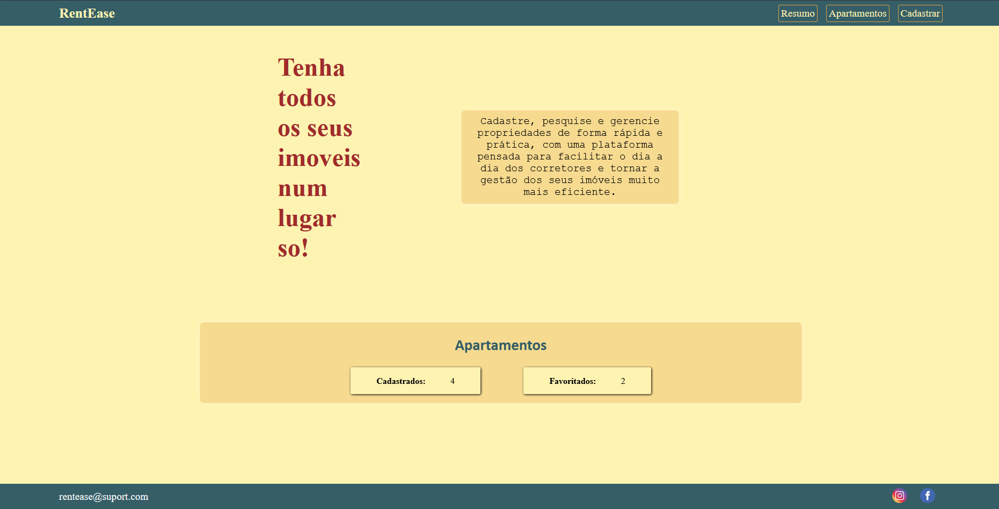
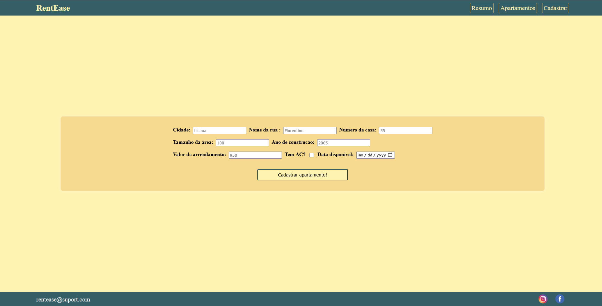
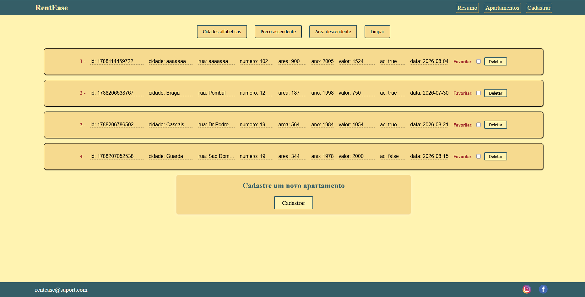

# RentEase

**RentEase** é uma plataforma web para gestão de portfólio de imóveis para arrendamento. Permite cadastrar, visualizar, favoritar, ordenar e remover apartamentos de forma simples e rápida, com todos os dados persistidos localmente no navegador.

---

## Sumário

- [Sobre o projeto](#sobre-o-projeto)
- [Funcionalidades](#funcionalidades)
  - [Navegação](#navegação)
  - [Página Resumo](#página-resumo)
  - [Página Cadastrar](#página-cadastrar)
  - [Página Apartamentos](#página-apartamentos)
- [Tecnologias utilizadas](#tecnologias-utilizadas)
- [Como executar o projeto](#como-executar-o-projeto)
- [Estrutura de pastas](#estrutura-de-pastas)
- [Capturas de tela](#capturas-de-tela)
- [Autor](#autor)

---

## Sobre o projeto

O **RentEase** foi criado para facilitar a organização de um portfólio de apartamentos destinados a arrendamento. Através de uma interface simples, o utilizador consegue cadastrar cada imóvel com os seus dados principais, acompanhar quantos apartamentos possui, marcar os favoritos e ordenar a lista conforme a necessidade (por cidade, preço ou área).

Todos os dados são guardados no **`localStorage`** do navegador, o que significa que as informações permanecem disponíveis entre sessões sem a necessidade de um servidor ou banco de dados externo.

---

## Funcionalidades

### Navegação

O site é composto por 3 páginas, acessíveis a partir de uma navbar fixa presente em todas elas:

| Botão | Ação |
|---|---|
| **Resumo** | Leva à página inicial, com o panorama geral do portfólio. |
| **Apartamentos** | Leva à listagem completa dos imóveis cadastrados. |
| **Cadastrar** | Leva ao formulário de cadastro de um novo apartamento. |

### Página Resumo

Página inicial do site. Apresenta um resumo rápido do portfólio, exibindo:

- **Total de apartamentos cadastrados** (contador numérico).
- **Total de apartamentos favoritados** (contador numérico).

### Página Cadastrar

Formulário utilizado para cadastrar um novo apartamento no portfólio. Os campos solicitados são:

- **Cidade**
- **Rua**
- **Número da casa**
- **Área do imóvel** (m²)
- **Ano** do imóvel
- **Valor** do arrendamento
- **Ar condicionado** (possui ou não)
- **Disponibilidade** (data a partir da qual o imóvel fica disponível para arrendar)

**Validação:** se algum campo obrigatório for preenchido incorretamente ou deixado em branco, o cadastro **não é salvo**. Nesse caso:

- É exibida uma **mensagem de erro** informando o problema.
- Os campos inválidos/incompletos recebem uma **borda vermelha**, indicando visualmente onde está o erro.

**Após o cadastro com sucesso:** é aberto um **modal** com duas opções:

1. Continuar cadastrando outro apartamento (permanece na página de Cadastro).
2. Ir para a página **Apartamentos**, para visualizar o imóvel recém-cadastrado.

### Página Apartamentos

Exibe todos os apartamentos cadastrados em formato de **cards**. Cada card contém:

- **Número identificador** do cadastro (referente à ordem/ID de criação).
- Todos os dados preenchidos no cadastro (cidade, rua, número, área, ano, valor, ar condicionado, disponibilidade).
- **Checkbox de favorito**, para marcar/desmarcar o apartamento como favorito.
- **Botão de eliminar**, que abre um modal de confirmação antes de remover definitivamente o cadastro.

**Filtros e ordenação:** no fim da página há 4 botões para reorganizar os cards exibidos:

| Botão | Efeito |
|---|---|
| **Cidade (A–Z)** | Ordena os cards por cidade, em ordem alfabética crescente. |
| **Preço (crescente)** | Ordena os cards do menor para o maior valor. |
| **Área (decrescente)** | Ordena os cards da maior para a menor área. |
| **Limpar** | Remove qualquer ordenação aplicada e retorna os cards à ordem original de cadastro. |

---

## Tecnologias utilizadas

- **HTML5** — estrutura das páginas.
- **CSS3** — estilização e layout.
- **JavaScript** — lógica de validação, filtros, modais e manipulação do DOM.
- **localStorage** — persistência dos dados dos apartamentos diretamente no navegador, sem necessidade de backend.

---

## Como executar o projeto

Por se tratar de um projeto em HTML, CSS e JavaScript puro, não é necessário instalar dependências.

1. Clone o repositório:
   ```bash
   git clone https://github.com/pflt/projeto-2-TechOf.git
   ```
2. Entre na pasta do projeto:
   ```bash
   cd rentease
   ```

> Como os dados são salvos via `localStorage`, eles ficam vinculados ao navegador e ao domínio/porta usados para abrir o projeto. Limpar os dados de navegação do site apaga o portfólio cadastrado.

---

## Estrutura de pastas

> Estrutura de referência 

```
rentease/
├── index.html           # Página Resumo
├── apartamentos.html    # Página Apartamentos
├── cadastrar.html       # Página Cadastrar
├── css/
│   └── style.css
├── js/
│   ├── resumo.js
│   ├── apartamentos.js
│   └── cadastrar.js
└── README.md
```

---

## Capturas de tela da pagina

**Página Resumo**



**Página Cadastrar**



**Página Apartamentos**



---

## Autor

Desenvolvido por **Pedro Terrone**.